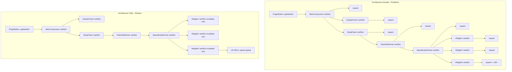

# Plan : Optimisation Lazy Repaint pour changement de skin

## Contexte

Le profiling Instruments (build RelWithDebInfo) révèle que le changement de skin Black/Cream prend **4.3 secondes**, entièrement consommé par la cascade `setSkin()` qui propage le nouveau skin à tous les widgets de l'interface.

### Problème identifié

Chaque widget appelle `repaint()` dans sa méthode `setSkin()` :

```cpp
void Label::setSkin(tss::Skin& skin)
{
    skin_ = &skin;
    updateSkinCache();
    invalidateCache();
    repaint();  // ← PROBLÈME : des centaines d'appels individuels
}
```

Avec **32 classes** ayant une méthode `setSkin()` et des dizaines d'instances de chaque classe, cela génère des **centaines de repaints** qui se chevauchent et surchargent le système de rendu JUCE.

### Distribution du temps (profiling)

- `MainComponent::setSkin` : 526.70 ms (32.3%)
  - `BodyPanel::setSkin` : 432.80 ms (26.5%)
    - `PatchEditPanel::setSkin` : 219.50 ms (13.5%)
    - `BaseModulePanel::setSkin` : 182.40 ms (11.2%)
    - `MasterEditPanel::setSkin` : 175.70 ms (10.8%)
    - `MatrixModulationPanel::setSkin` : ...
    - etc.

## Solution : Repaint Lazy

### Principe

Au lieu de déclencher un `repaint()` immédiat dans chaque `setSkin()`, on invalide simplement le cache et on laisse JUCE appeler `paint()` naturellement lors du prochain cycle de rendu. Un seul `repaint()` global est déclenché à la fin de la propagation complète.

### Architecture actuelle vs cible




### Implémentation

#### 1. Widgets (14 fichiers)

Pour chaque widget ([Label.cpp](Source/GUI/Widgets/Label.cpp), [Button.cpp](Source/GUI/Widgets/Button.cpp), [Slider.cpp](Source/GUI/Widgets/Slider.cpp), [ComboBox.cpp](Source/GUI/Widgets/ComboBox.cpp), etc.) :

**AVANT :**

```cpp
void Widget::setSkin(tss::Skin& skin)
{
    skin_ = &skin;
    updateSkinCache();      // Met à jour les couleurs/fonts depuis le skin
    invalidateCache();      // Marque l'image HiDPI comme invalide
    repaint();              // ← À SUPPRIMER
}
```

**APRÈS :**

```cpp
void Widget::setSkin(tss::Skin& skin)
{
    skin_ = &skin;
    invalidateCache();      // Marque comme invalide, paint() régénérera
    // PAS de repaint() ici
}
```

**Explication :** Le cache HiDPI sera régénéré automatiquement lors du prochain `paint()` grâce au pattern existant :

```cpp
void Widget::paint(juce::Graphics& g)
{
    if (!cacheValid_)
        regenerateCache();  // Appelle skin_->getColor() ici, pas dans setSkin()
    
    g.drawImage(cachedImage_, ...);
}
```

#### 2. Panneaux (18 fichiers)

Pour chaque panneau ([MainComponent.cpp](Source/GUI/MainComponent.cpp), [BodyPanel.cpp](Source/GUI/Panels/MainComponent/BodyPanel/BodyPanel.cpp), [BaseModulePanel.cpp](Source/GUI/Panels/Reusable/BaseModulePanel.cpp), etc.) :

**AVANT :**

```cpp
void Panel::setSkin(tss::Skin& skin)
{
    skin_ = &skin;
    childPanel1.setSkin(skin);
    childPanel2.setSkin(skin);
    repaint();  // ← À SUPPRIMER (certains panneaux)
}
```

**APRÈS :**

```cpp
void Panel::setSkin(tss::Skin& skin)
{
    skin_ = &skin;
    childPanel1.setSkin(skin);  // Propage sans repaint
    childPanel2.setSkin(skin);
    // PAS de repaint() ici
}
```

#### 3. PluginEditor (point d'entrée)

[Source/GUI/PluginEditor.cpp](Source/GUI/PluginEditor.cpp) - **UN SEUL repaint global** après propagation complète :

**AVANT :**

```cpp
void PluginEditor::updateSkin()
{
    if (auto* widget = mainComponent.get())
        widget->setSkin(*skin_);
    repaint();  // Déjà présent, mais insuffisant
}
```

**APRÈS (inchangé)** :

```cpp
void PluginEditor::updateSkin()
{
    if (auto* widget = mainComponent.get())
        widget->setSkin(*skin_);  // Propage sans repaints individuels
    repaint();  // UN SEUL repaint global déclenche la cascade paint()
}
```

Ce repaint() global est déjà présent et suffisant. Il déclenche JUCE à invalider toute la hiérarchie de composants et les repeindre en **une seule passe optimisée**.

## Fichiers impactés

### Widgets (14 fichiers)


| Fichier                                                                                      | Action                                                      |
| -------------------------------------------------------------------------------------------- | ----------------------------------------------------------- |
| [Source/GUI/Widgets/Label.cpp](Source/GUI/Widgets/Label.cpp)                                 | Supprimer `updateSkinCache()` et `repaint()` de `setSkin()` |
| [Source/GUI/Widgets/Button.cpp](Source/GUI/Widgets/Button.cpp)                               | Supprimer `repaint()` de `setSkin()`                        |
| [Source/GUI/Widgets/Slider.cpp](Source/GUI/Widgets/Slider.cpp)                               | Supprimer `repaint()` de `setSkin()`                        |
| [Source/GUI/Widgets/ComboBox.cpp](Source/GUI/Widgets/ComboBox.cpp)                           | Supprimer `repaint()` de `setSkin()`                        |
| [Source/GUI/Widgets/NumberBox.cpp](Source/GUI/Widgets/NumberBox.cpp)                         | Supprimer `repaint()` de `setSkin()`                        |
| [Source/GUI/Widgets/EnvelopeDisplay.cpp](Source/GUI/Widgets/EnvelopeDisplay.cpp)             | Supprimer `repaint()` de `setSkin()`                        |
| [Source/GUI/Widgets/TrackGeneratorDisplay.cpp](Source/GUI/Widgets/TrackGeneratorDisplay.cpp) | Supprimer `repaint()` de `setSkin()`                        |
| [Source/GUI/Widgets/PatchNameDisplay.cpp](Source/GUI/Widgets/PatchNameDisplay.cpp)           | Supprimer `repaint()` de `setSkin()`                        |
| [Source/GUI/Widgets/ModuleHeader.cpp](Source/GUI/Widgets/ModuleHeader.cpp)                   | Supprimer `repaint()` de `setSkin()`                        |
| [Source/GUI/Widgets/ModulationBusHeader.cpp](Source/GUI/Widgets/ModulationBusHeader.cpp)     | Supprimer `repaint()` de `setSkin()`                        |
| [Source/GUI/Widgets/GroupLabel.cpp](Source/GUI/Widgets/GroupLabel.cpp)                       | Supprimer `repaint()` de `setSkin()`                        |
| [Source/GUI/Widgets/SectionHeader.cpp](Source/GUI/Widgets/SectionHeader.cpp)                 | Supprimer `repaint()` de `setSkin()`                        |
| [Source/GUI/Widgets/HorizontalSeparator.cpp](Source/GUI/Widgets/HorizontalSeparator.cpp)     | Supprimer `repaint()` de `setSkin()`                        |
| [Source/GUI/Widgets/VerticalSeparator.cpp](Source/GUI/Widgets/VerticalSeparator.cpp)         | Supprimer `repaint()` de `setSkin()`                        |


### Panneaux (18 fichiers)


| Fichier                                                                                                                                                                                      | Action                                           |
| -------------------------------------------------------------------------------------------------------------------------------------------------------------------------------------------- | ------------------------------------------------ |
| [Source/GUI/MainComponent.cpp](Source/GUI/MainComponent.cpp)                                                                                                                                 | Vérifier absence de `repaint()` dans `setSkin()` |
| [Source/GUI/Panels/Reusable/ParameterPanel.cpp](Source/GUI/Panels/Reusable/ParameterPanel.cpp)                                                                                               | Supprimer `repaint()` si présent                 |
| [Source/GUI/Panels/Reusable/ModuleHeaderPanel.cpp](Source/GUI/Panels/Reusable/ModuleHeaderPanel.cpp)                                                                                         | Supprimer `repaint()` si présent                 |
| [Source/GUI/Panels/Reusable/ModulationBusPanel.cpp](Source/GUI/Panels/Reusable/ModulationBusPanel.cpp)                                                                                       | Supprimer `repaint()` si présent                 |
| [Source/GUI/Panels/Reusable/BaseModulePanel.cpp](Source/GUI/Panels/Reusable/BaseModulePanel.cpp)                                                                                             | Supprimer `repaint()` si présent                 |
| [Source/GUI/Panels/MainComponent/HeaderPanel/HeaderPanel.cpp](Source/GUI/Panels/MainComponent/HeaderPanel/HeaderPanel.cpp)                                                                   | Supprimer `repaint()` si présent                 |
| [Source/GUI/Panels/MainComponent/FooterPanel/FooterPanel.cpp](Source/GUI/Panels/MainComponent/FooterPanel/FooterPanel.cpp)                                                                   | Supprimer `repaint()` si présent                 |
| [Source/GUI/Panels/MainComponent/BodyPanel/BodyPanel.cpp](Source/GUI/Panels/MainComponent/BodyPanel/BodyPanel.cpp)                                                                           | Supprimer `repaint()` si présent                 |
| [Source/GUI/Panels/MainComponent/BodyPanel/PatchManagerPanel/PatchManagerPanel.cpp](Source/GUI/Panels/MainComponent/BodyPanel/PatchManagerPanel/PatchManagerPanel.cpp)                       | Supprimer `repaint()` si présent                 |
| [Source/GUI/Panels/MainComponent/BodyPanel/PatchManagerPanel/Modules/InternalPatchesPanel.cpp](Source/GUI/Panels/MainComponent/BodyPanel/PatchManagerPanel/Modules/InternalPatchesPanel.cpp) | Supprimer `repaint()` si présent                 |
| [Source/GUI/Panels/MainComponent/BodyPanel/PatchManagerPanel/Modules/ComputerPatchesPanel.cpp](Source/GUI/Panels/MainComponent/BodyPanel/PatchManagerPanel/Modules/ComputerPatchesPanel.cpp) | Supprimer `repaint()` si présent                 |
| [Source/GUI/Panels/MainComponent/BodyPanel/PatchManagerPanel/Modules/BankUtilityPanel.cpp](Source/GUI/Panels/MainComponent/BodyPanel/PatchManagerPanel/Modules/BankUtilityPanel.cpp)         | Supprimer `repaint()` si présent                 |
| [Source/GUI/Panels/MainComponent/BodyPanel/PatchEditPanel/PatchEditPanel.cpp](Source/GUI/Panels/MainComponent/BodyPanel/PatchEditPanel/PatchEditPanel.cpp)                                   | Supprimer `repaint()` si présent                 |
| [Source/GUI/Panels/MainComponent/BodyPanel/PatchEditPanel/TopPanel/TopPanel.cpp](Source/GUI/Panels/MainComponent/BodyPanel/PatchEditPanel/TopPanel/TopPanel.cpp)                             | Supprimer `repaint()` si présent                 |
| [Source/GUI/Panels/MainComponent/BodyPanel/PatchEditPanel/MiddlePanel/MiddlePanel.cpp](Source/GUI/Panels/MainComponent/BodyPanel/PatchEditPanel/MiddlePanel/MiddlePanel.cpp)                 | Supprimer `repaint()` si présent                 |
| [Source/GUI/Panels/MainComponent/BodyPanel/PatchEditPanel/BottomPanel/BottomPanel.cpp](Source/GUI/Panels/MainComponent/BodyPanel/PatchEditPanel/BottomPanel/BottomPanel.cpp)                 | Supprimer `repaint()` si présent                 |
| [Source/GUI/Panels/MainComponent/BodyPanel/MatrixModulationPanel/MatrixModulationPanel.cpp](Source/GUI/Panels/MainComponent/BodyPanel/MatrixModulationPanel/MatrixModulationPanel.cpp)       | Supprimer `repaint()` si présent                 |
| [Source/GUI/Panels/MainComponent/BodyPanel/MasterEditPanel/MasterEditPanel.cpp](Source/GUI/Panels/MainComponent/BodyPanel/MasterEditPanel/MasterEditPanel.cpp)                               | Supprimer `repaint()` si présent                 |


### Vérification


| Fichier                                                    | Action                                                               |
| ---------------------------------------------------------- | -------------------------------------------------------------------- |
| [Source/GUI/PluginEditor.cpp](Source/GUI/PluginEditor.cpp) | Vérifier que `repaint()` global est bien présent dans `updateSkin()` |


## Gain attendu

- Réduction du temps de changement de skin : **4.3s → < 0.5s**
- Un seul cycle de rendu JUCE au lieu de centaines
- Pattern lazy plus cohérent avec l'architecture JUCE

## Tests de validation

1. Compiler en RelWithDebInfo
2. Tester visuellement Black → Cream → Black
3. Profiler avec Instruments : le temps `setSkin()` doit chuter drastiquement
4. Vérifier qu'aucun artefact visuel n'apparaît

## Notes d'implémentation

- La suppression de `updateSkinCache()` dans `Label::setSkin()` est importante : le cache sera mis à jour lors du `regenerateCache()` appelé par `paint()`
- Certains panneaux n'appellent déjà pas `repaint()` dans `setSkin()` (ex: MainComponent) → pas de modification nécessaire
- Le pattern lazy est déjà en place grâce à `cacheValid_` et `regenerateCache()` dans les widgets

