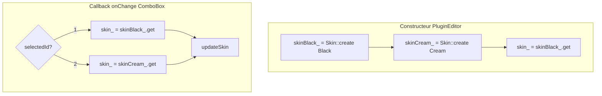

# Plan : Optimisation Skin par pré-création

## Contexte

Le profiling Instruments (build Debug) a révélé que le changement de skin Black/Cream prend 4-5 secondes, avec deux goulots d'étranglement principaux :

- **Skin::create** : 2.55 s (35.4%) — un nouveau Skin est créé à chaque changement
- **PluginEditor::updateSkin** + cascade setSkin : 3.35 s (46.6%)

## Cause identifiée

Dans [Source/GUI/PluginEditor.cpp](Source/GUI/PluginEditor.cpp), le callback du ComboBox Skin appelle `Skin::create()` à chaque sélection :

```cpp
headerPanel.getSkinComboBox().onChange = [this, &headerPanel]
{
    const auto selectedId = headerPanel.getSkinComboBox().getSelectedId();
    if (selectedId == 1)
    {
        skin = tss::Skin::create(tss::Skin::ColourVariant::Black);  // Nouvelle allocation
        updateSkin();
    }
    else if (selectedId == 2)
    {
        skin = tss::Skin::create(tss::Skin::ColourVariant::Cream);  // Nouvelle allocation
        updateSkin();
    }
};
```

## Solution

Pré-créer les deux Skin (Black et Cream) une seule fois dans le constructeur, puis ne faire que basculer le pointeur actif dans le callback.

## Architecture cible




## Modifications à apporter

### 1. PluginEditor.h

- Remplacer `std::unique_ptr<tss::Skin> skin` par :
  - `std::unique_ptr<tss::Skin> skinBlack_`
  - `std::unique_ptr<tss::Skin> skinCream_`
  - `tss::Skin* skin_` (pointeur non-propriétaire vers le Skin actif)

### 2. PluginEditor.cpp

**Constructeur :**

- Créer les deux skins au démarrage : `skinBlack_ = Skin::create(Black)`, `skinCream_ = Skin::create(Cream)`
- Initialiser `skin_ = skinBlack_.get()`
- Passer `*skin_` au MainComponent (au lieu de `*skin`)
- Dans le callback onChange : `skin_ = (selectedId == 1) ? skinBlack_.get() : skinCream_.get();` puis `updateSkin()`

**paint() :**

- Remplacer `skin->` par `skin_->`

**updateSkin() :**

- Remplacer `widget->setSkin(*skin)` par `widget->setSkin(*skin_)`

### 3. Vérifications

- S'assurer qu'aucun autre code ne dépend de `skin` en tant qu'unique_ptr (recherche dans le projet)
- Tester le changement Black → Cream → Black et vérifier le comportement visuel
- Re-profiler avec Instruments pour valider la réduction du temps (Skin::create ne doit plus apparaître dans le callback)

## Fichiers impactés


| Fichier                                                    | Action                                    |
| ---------------------------------------------------------- | ----------------------------------------- |
| [Source/GUI/PluginEditor.h](Source/GUI/PluginEditor.h)     | Modifier les membres skin                 |
| [Source/GUI/PluginEditor.cpp](Source/GUI/PluginEditor.cpp) | Constructeur, callback, paint, updateSkin |


## Gain attendu

- Suppression de ~2.5 s (35%) à chaque changement de skin (plus de Skin::create dans le chemin critique)
- La cascade setSkin/repaint restera, mais sans le coût d'allocation et d'initialisation du Skin

## Documenter le plan

Sauvegarder une copie de ce plan dans `Documentation/Development/Refactorisation/` avec le nom : `2026-02-03-Skin-Precreation-Optimization-Plan.md`