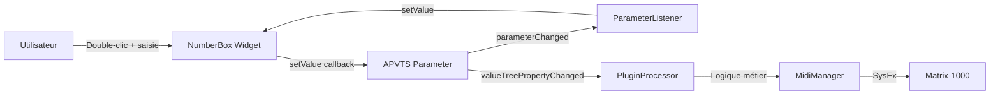

# Intégration APVTS des NumberBox et correction des warnings Font

## Contexte

Actuellement, les `NumberBox` pour `currentBankNumber` et `currentPatchNumber` sont des widgets standalone non connectés à l'APVTS. Pour une architecture cohérente et permettre au `PluginProcessor` de gérer la logique métier (chargement de patches, changement de banque), il faut les intégrer dans l'APVTS.

De plus, 13 warnings de dépréciation concernant les constructeurs `Font()` doivent être corrigés en utilisant `juce::FontOptions()`.

## Partie 1 : Correction des warnings Font (prioritaire)

### Fichiers concernés (13 warnings)

D'après la capture d'écran et le grep, les fichiers suivants utilisent le constructeur `Font()` déprécié :

1. `[Source/GUI/Widgets/ComboBox.cpp](Source/GUI/Widgets/ComboBox.cpp)` - ligne 9
2. `[Source/GUI/Widgets/GroupLabel.cpp](Source/GUI/Widgets/GroupLabel.cpp)` - ligne 7
3. `[Source/GUI/Widgets/Label.cpp](Source/GUI/Widgets/Label.cpp)` - ligne 7
4. `[Source/GUI/Widgets/ModulationBusHeader.cpp](Source/GUI/Widgets/ModulationBusHeader.cpp)` - ligne 8
5. `[Source/GUI/Widgets/ModuleHeader.cpp](Source/GUI/Widgets/ModuleHeader.cpp)` - ligne 7
6. `[Source/GUI/Widgets/NumberBox.cpp](Source/GUI/Widgets/NumberBox.cpp)` - ligne 9 ✅ (déjà corrigé : `cachedFont_(juce::FontOptions())`)
7. `[Source/GUI/Widgets/SectionHeader.cpp](Source/GUI/Widgets/SectionHeader.cpp)` - ligne 7
8. `[Source/GUI/Widgets/Slider.cpp](Source/GUI/Widgets/Slider.cpp)` - ligne 7

**Note** : Il semble y avoir d'autres occurrences non listées dans le grep initial. Il faudra vérifier tous les constructeurs de widgets.

### Stratégie de correction

Dans chaque constructeur de widget, remplacer :

```cpp
// ❌ Ancien (déprécié)
, cachedFont_(juce::Font())

// ✅ Nouveau
, cachedFont_(juce::FontOptions())
```

Cette modification est triviale mais nécessaire pour éliminer tous les warnings.

## Partie 2 : Intégration APVTS des NumberBox

### Étape 1 : Créer les descripteurs de paramètres

**Fichier** : `[Source/Shared/PluginDescriptors.h](Source/Shared/PluginDescriptors.h)`

Ajouter les déclarations dans la section "Patch Manager | Standalone Widgets" (après ligne 165) :

```cpp
// Patch Manager | Internal Patches Parameter Widgets
extern const std::vector<IntParameterDescriptor> kInternalPatchesIntParameters;
```

**Fichier** : `[Source/Shared/PluginDescriptors.cpp](Source/Shared/PluginDescriptors.cpp)`

Ajouter les définitions des paramètres (avant la section `kInternalPatchesWidgets`, vers ligne 2190) :

```cpp
// Internal Patches Module | Int Parameters
const std::vector<IntParameterDescriptor> kInternalPatchesIntParameters = {
    {
        .parameterId = ParameterIds::kCurrentBankNumber,
        .displayName = "Current Bank",
        .parentGroupId = ModuleIds::kInternalPatches,
        .minValue = Matrix1000Limits::kMinBankNumber,
        .maxValue = Matrix1000Limits::kMaxBankNumber,
        .defaultValue = 0,
        .sysExOffset = kNoSysExId,  // Pas directement mappé en SysEx
        .sysExId = kNoSysExId
    },
    {
        .parameterId = ParameterIds::kCurrentPatchNumber,
        .displayName = "Current Patch",
        .parentGroupId = ModuleIds::kInternalPatches,
        .minValue = Matrix1000Limits::kMinPatchNumber,
        .maxValue = Matrix1000Limits::kMaxPatchNumber,
        .defaultValue = 0,
        .sysExOffset = kNoSysExId,  // Pas directement mappé en SysEx
        .sysExId = kNoSysExId
    }
};
```

**Fichier** : `[Source/Shared/PluginIDs.h](Source/Shared/PluginIDs.h)`

Ajouter les IDs dans le namespace `ParameterIds` (après ligne 382, dans la section Patch Manager) :

```cpp
// Patch Manager | Internal Patches Parameter IDs
constexpr const char* kCurrentBankNumber          = "currentBankNumber";
constexpr const char* kCurrentPatchNumber         = "currentPatchNumber";
```

### Étape 2 : Ajouter les paramètres à l'APVTS

**Fichier** : `[Source/Core/Factories/ApvtsFactory.cpp](Source/Core/Factories/ApvtsFactory.cpp)`

1. **Dans `getAllIntParameters()**` (vers ligne 120-140) :

Ajouter après les autres modules :

```cpp
addParameters(PluginDescriptors::kInternalPatchesIntParameters);
```

1. **Dans `createParameterLayout()**` (vers ligne 30-80) :

Ajouter la création des paramètres pour Internal Patches :

```cpp
// Patch Manager | Internal Patches Parameters
for (const auto& param : PluginDescriptors::kInternalPatchesIntParameters)
{
    layout.add(std::make_unique<juce::AudioParameterInt>(
        juce::ParameterID(param.parameterId, kParameterVersionHint),
        param.displayName,
        param.minValue,
        param.maxValue,
        param.defaultValue));
}
```

### Étape 3 : Créer la méthode factory pour NumberBox avec attachment

**Fichier** : `[Source/GUI/Factories/WidgetFactory.h](Source/GUI/Factories/WidgetFactory.h)`

Ajouter la déclaration de méthode (après ligne 42) :

```cpp
std::unique_ptr<tss::NumberBox> createIntParameterNumberBox(
    const juce::String& parameterId,
    tss::Skin& skin,
    int width,
    bool editable);
```

Ajouter un membre privé pour stocker les attachments :

```cpp
private:
    juce::AudioProcessorValueTreeState& apvts_;  // Ajouter référence APVTS
    
    // Existing members...
    std::map<juce::String, std::unique_ptr<juce::AudioProcessorValueTreeState::SliderAttachment>> numberBoxAttachments_;
```

**Note** : JUCE n'a pas de `NumberBoxAttachment` natif. Il faudra utiliser un `SliderAttachment` car `NumberBox` n'hérite pas de `juce::Slider`. Deux options :

**Option A (recommandée)** : Faire hériter `NumberBox` de `juce::Slider` (comme `tss::Slider`)
**Option B** : Créer un système de callback manuel pour synchroniser avec l'APVTS

Pour ce plan, nous utiliserons **Option B** (plus simple, moins invasif).

**Fichier** : `[Source/GUI/Factories/WidgetFactory.cpp](Source/GUI/Factories/WidgetFactory.cpp)`

Implémenter la méthode :

```cpp
std::unique_ptr<tss::NumberBox> WidgetFactory::createIntParameterNumberBox(
    const juce::String& parameterId,
    tss::Skin& skin,
    int width,
    bool editable)
{
    const auto* descriptor = findIntParameter(parameterId);
    
    if (descriptor == nullptr)
    {
        throw WidgetFactoryExceptions::ParameterNotFoundException(parameterId);
    }
    
    auto numberBox = std::make_unique<tss::NumberBox>(
        skin,
        width,
        editable,
        descriptor->minValue,
        descriptor->maxValue);
    
    // Synchroniser la valeur initiale depuis l'APVTS
    if (auto* param = apvts_.getParameter(parameterId))
    {
        const int initialValue = static_cast<int>(param->getValue() * 
            (descriptor->maxValue - descriptor->minValue) + descriptor->minValue);
        numberBox->setValue(initialValue);
    }
    
    // Listener APVTS → NumberBox
    apvts_.addParameterListener(parameterId, /* TODO: créer un listener */);
    
    // Callback NumberBox → APVTS
    // TODO: ajouter un système de callback dans NumberBox
    
    return numberBox;
}
```

### Étape 4 : Ajouter un système de callback dans NumberBox

**Fichier** : `[Source/GUI/Widgets/NumberBox.h](Source/GUI/Widgets/NumberBox.h)`

Ajouter une callback :

```cpp
public:
    using ValueChangedCallback = std::function<void(int)>;
    
    void setOnValueChanged(ValueChangedCallback callback);

private:
    ValueChangedCallback onValueChanged_;
```

**Fichier** : `[Source/GUI/Widgets/NumberBox.cpp](Source/GUI/Widgets/NumberBox.cpp)`

Implémenter :

```cpp
void NumberBox::setOnValueChanged(ValueChangedCallback callback)
{
    onValueChanged_ = std::move(callback);
}

void NumberBox::setValue(int newValue)
{
    const int clampedValue = juce::jlimit(minValue_, maxValue_, newValue);
    
    if (currentValue_ != clampedValue)
    {
        currentValue_ = clampedValue;
        updateTextWidthCache();
        invalidateCache();
        repaint();
        
        // Notifier le callback
        if (onValueChanged_)
            onValueChanged_(clampedValue);
    }
}
```

### Étape 5 : Créer un ParameterListener pour la synchronisation APVTS → NumberBox

**Fichier** : `[Source/GUI/Factories/WidgetFactory.h](Source/GUI/Factories/WidgetFactory.h)`

Ajouter une classe interne :

```cpp
private:
    class NumberBoxParameterListener : public juce::AudioProcessorValueTreeState::Listener
    {
    public:
        NumberBoxParameterListener(tss::NumberBox& numberBox, int minValue, int maxValue)
            : numberBox_(numberBox), minValue_(minValue), maxValue_(maxValue) {}
        
        void parameterChanged(const juce::String& parameterID, float newValue) override
        {
            const int intValue = static_cast<int>(newValue * (maxValue_ - minValue_) + minValue_);
            numberBox_.setValue(intValue);
        }
    
    private:
        tss::NumberBox& numberBox_;
        int minValue_;
        int maxValue_;
    };
    
    std::map<juce::String, std::unique_ptr<NumberBoxParameterListener>> numberBoxListeners_;
```

### Étape 6 : Mettre à jour InternalPatchesPanel

**Fichier** : `[Source/GUI/Panels/MainComponent/BodyPanel/PatchManagerPanel/Modules/InternalPatchesPanel.cpp](Source/GUI/Panels/MainComponent/BodyPanel/PatchManagerPanel/Modules/InternalPatchesPanel.cpp)`

Remplacer les créations manuelles par des appels à `WidgetFactory` :

```cpp
void InternalPatchesPanel::setupCurrentBankNumberBox(tss::Skin& skin, WidgetFactory& widgetFactory)
{
    currentBankNumber = widgetFactory.createIntParameterNumberBox(
        PluginDescriptors::ParameterIds::kCurrentBankNumber,
        skin,
        PluginDimensions::Widgets::Widths::NumberBox::kPatchManagerBankNumber,
        false);  // non éditable
    currentBankNumber->setShowDot(true);
    addAndMakeVisible(*currentBankNumber);
}

void InternalPatchesPanel::setupCurrentPatchNumberBox(tss::Skin& skin, WidgetFactory& widgetFactory)
{
    currentPatchNumber = widgetFactory.createIntParameterNumberBox(
        PluginDescriptors::ParameterIds::kCurrentPatchNumber,
        skin,
        PluginDimensions::Widgets::Widths::NumberBox::kPatchManagerPatchNumber,
        true);  // éditable
    addAndMakeVisible(*currentPatchNumber);
}
```

Mettre à jour les signatures des méthodes dans le `.h` pour accepter `WidgetFactory&`.

### Étape 7 : Implémenter la logique métier dans PluginProcessor

**Fichier** : `[Source/Core/PluginProcessor.cpp](Source/Core/PluginProcessor.cpp)`

Dans la méthode `valueTreePropertyChanged()`, ajouter la gestion des changements :

```cpp
void PluginProcessor::valueTreePropertyChanged(juce::ValueTree& treeWhosePropertyHasChanged,
                                              const juce::Identifier& property)
{
    // ... code existant ...
    
    const auto parameterId = resolveParameterIdFromTree(treeWhosePropertyHasChanged, property);
    
    // Gestion du changement de banque
    if (parameterId == PluginDescriptors::ParameterIds::kCurrentBankNumber)
    {
        const auto* param = apvts.getParameter(parameterId);
        if (param != nullptr)
        {
            const int bankNumber = static_cast<int>(param->getValue() * 
                PluginDescriptors::Matrix1000Limits::kMaxBankNumber);
            
            // TODO: Envoyer commande SysEx pour changer de banque
            // midiManager->sendBankChangeCommand(bankNumber);
            
            juce::Logger::writeToLog("Bank changed to: " + juce::String(bankNumber));
        }
    }
    
    // Gestion du changement de patch
    if (parameterId == PluginDescriptors::ParameterIds::kCurrentPatchNumber)
    {
        const auto* param = apvts.getParameter(parameterId);
        if (param != nullptr)
        {
            const int patchNumber = static_cast<int>(param->getValue() * 
                PluginDescriptors::Matrix1000Limits::kMaxPatchNumber);
            
            // TODO: Envoyer commande SysEx pour charger le patch
            // midiManager->sendPatchLoadCommand(patchNumber);
            
            juce::Logger::writeToLog("Patch changed to: " + juce::String(patchNumber));
        }
    }
}
```

## Architecture finale




## Validation

Après implémentation, vérifier que :

- ✓ Aucun warning de compilation (Font dépréciés corrigés)
- ✓ Les NumberBox sont synchronisés avec l'APVTS
- ✓ Modifier `currentPatchNumber` via GUI met à jour l'APVTS
- ✓ Modifier le paramètre APVTS programmatiquement met à jour le NumberBox
- ✓ Le PluginProcessor reçoit les notifications de changement
- ✓ Les valeurs sont sauvegardées/restaurées avec l'état du plugin

## Notes importantes

1. **Thread-safety** : Les callbacks APVTS peuvent être appelés depuis n'importe quel thread. Utiliser `juce::MessageManager::callAsync()` si nécessaire pour les mises à jour GUI.
2. **Éviter les boucles infinies** : Attention à ne pas créer de boucle `NumberBox → APVTS → Listener → NumberBox`. Utiliser un flag `isUpdatingFromParameter_` si nécessaire.
3. **Gestion mémoire** : Les listeners doivent être détruits proprement dans le destructeur de `WidgetFactory` ou du panel.
4. **SysEx** : La logique d'envoi SysEx vers le Matrix-1000 sera implémentée ultérieurement (hors scope de ce plan).

