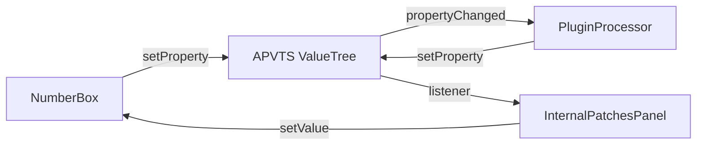
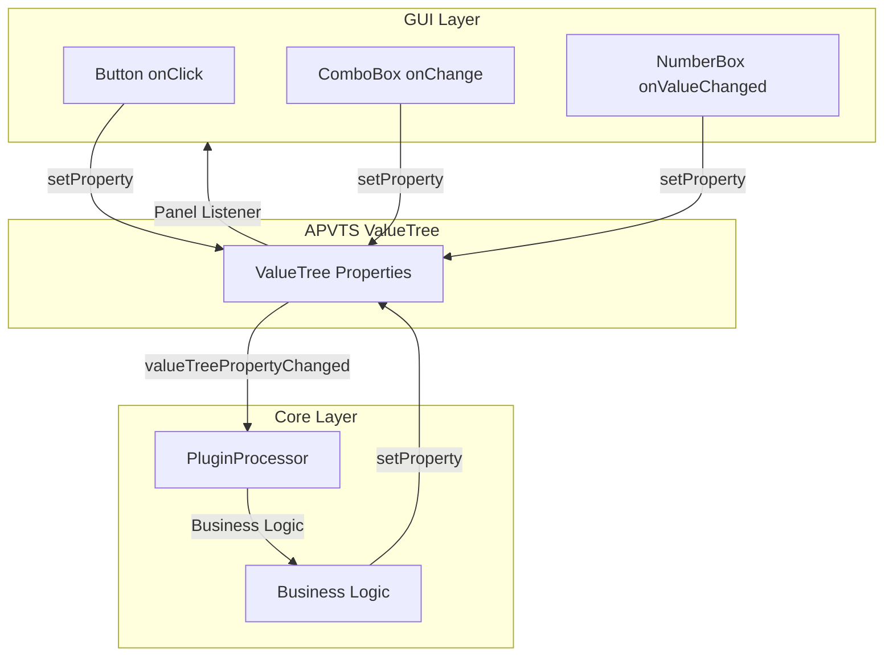

# Correction architecture NumberBox : Properties au lieu de Parameters

## Contexte et problème

L'implémentation actuelle utilise des `AudioParameterInt` pour les `NumberBox`, ce qui est incorrect selon l'architecture du plugin. Les `currentBankNumber` et `currentPatchNumber` sont des **widgets standalone** (état de navigation UI) et non des **paramètres de synthé** (données SysEx).

### Architecture actuelle (incorrecte)


**Problèmes** :

- Collision d'IDs entre `StandaloneWidgetIds` et `ParameterIds` (nécessite suffixe "Param")
- Incohérent avec les boutons et la ComboBox `selectPatchFile`
- Les valeurs apparaîtraient dans l'automation DAW (non souhaité)

### Architecture cible (correcte)




**Avantages** :

- Cohérent avec les boutons (même pattern)
- Un seul ID dans `StandaloneWidgetIds` (pas de duplication)
- État interne du plugin (pas exposé à l'automation DAW)
- Homogénéité parfaite du code

## Modifications à effectuer

### Étape 1 : Nettoyer les Parameters APVTS (rollback)

**Fichier** : `[Source/Shared/PluginIDs.h](Source/Shared/PluginIDs.h)`

Supprimer les IDs de `ParameterIds` (lignes 289-291) :

```cpp
// À SUPPRIMER
// Patch Manager | Internal Patches Parameter IDs
constexpr const char* kCurrentBankNumberParam     = "currentBankNumberParam";
constexpr const char* kCurrentPatchNumberParam    = "currentPatchNumberParam";
```

**Fichier** : `[Source/Shared/PluginDisplayNames.h](Source/Shared/PluginDisplayNames.h)`

Supprimer les display names de `ParameterDisplayNames` (lignes 243-245) :

```cpp
// À SUPPRIMER
// Patch Manager | Internal Patches Parameter Display Names
constexpr const char* kCurrentBankNumber            = "CURRENT BANK";
constexpr const char* kCurrentPatchNumber           = "CURRENT PATCH";
```

**Fichier** : `[Source/Shared/PluginDescriptors.h](Source/Shared/PluginDescriptors.h)`

Supprimer la déclaration (ligne ~165) :

```cpp
// À SUPPRIMER
// Patch Manager | Internal Patches Parameter Widgets
extern const std::vector<IntParameterDescriptor> kInternalPatchesIntParameters;
```

**Fichier** : `[Source/Shared/PluginDescriptors.cpp](Source/Shared/PluginDescriptors.cpp)`

Supprimer la définition complète de `kInternalPatchesIntParameters` (lignes ~2193-2222, toute la section).

**Fichier** : `[Source/Core/Factories/ApvtsFactory.h](Source/Core/Factories/ApvtsFactory.h)`

Supprimer la déclaration de méthode :

```cpp
// À SUPPRIMER
static void addPatchManagerParameters(juce::AudioProcessorParameterGroup& patchManagerGroup);
```

**Fichier** : `[Source/Core/Factories/ApvtsFactory.cpp](Source/Core/Factories/ApvtsFactory.cpp)`

1. Restaurer le commentaire original dans `addParametersToChildGroup()` :

```cpp
else if (childGroupId == PluginDescriptors::SectionIds::kPatchManager)
{
    // Patch Manager uses ValueTree properties, not APVTS parameters
}
```

1. Supprimer la méthode `addPatchManagerParameters()` complète
2. Supprimer la ligne dans `getAllIntParameters()` :

```cpp
// À SUPPRIMER
addParams(PluginDescriptors::kInternalPatchesIntParameters);
```

**Fichier** : `[Source/Core/PluginProcessor.cpp](Source/Core/PluginProcessor.cpp)`

Supprimer la logique dans `valueTreePropertyChanged()` :

```cpp
// À SUPPRIMER (lignes ajoutées pour les Parameters)
if (parameterId == PluginDescriptors::ParameterIds::kCurrentBankNumberParam)
{
    // ...
}

if (parameterId == PluginDescriptors::ParameterIds::kCurrentPatchNumberParam)
{
    // ...
}
```

### Étape 2 : Simplifier WidgetFactory (rollback)

**Fichier** : `[Source/GUI/Factories/WidgetFactory.h](Source/GUI/Factories/WidgetFactory.h)`

Supprimer :

- La classe interne `NumberBoxParameterListener`
- La méthode `createIntParameterNumberBox()`
- Le membre `apvts_`
- Le membre `numberBoxListeners_`

**Fichier** : `[Source/GUI/Factories/WidgetFactory.cpp](Source/GUI/Factories/WidgetFactory.cpp)`

Supprimer :

- L'initialisation de `apvts_` dans le constructeur
- L'implémentation du constructeur `NumberBoxParameterListener`
- L'implémentation de `parameterChanged()`
- L'implémentation complète de `createIntParameterNumberBox()`
- L'include de `"GUI/Widgets/NumberBox.h"`
- La ligne dans `buildIntParameterMap()` : `addIntParametersToMap(PluginDescriptors::kInternalPatchesIntParameters);`

### Étape 3 : Simplifier NumberBox (rollback partiel)

**Fichier** : `[Source/GUI/Widgets/NumberBox.h](Source/GUI/Widgets/NumberBox.h)`

Supprimer :

- `using ValueChangedCallback = std::function<void(int)>;`
- `void setOnValueChanged(ValueChangedCallback callback);`
- `void setValueFromParameter(int newValue);`
- Le membre `ValueChangedCallback onValueChanged_;`
- Le membre `bool isUpdatingFromParameter_ = false;`

**Fichier** : `[Source/GUI/Widgets/NumberBox.cpp](Source/GUI/Widgets/NumberBox.cpp)`

Restaurer la méthode `setValue()` à sa version simple (sans callback ni flag) :

```cpp
void NumberBox::setValue(int newValue)
{
    const int clampedValue = juce::jlimit(minValue_, maxValue_, newValue);
    
    if (currentValue_ != clampedValue)
    {
        currentValue_ = clampedValue;
        updateTextWidthCache();
        invalidateCache();
        repaint();
    }
}
```

Supprimer les méthodes :

- `setOnValueChanged()`
- `setValueFromParameter()`

### Étape 4 : Implémenter le pattern Property dans InternalPatchesPanel

**Fichier** : `[Source/GUI/Panels/MainComponent/BodyPanel/PatchManagerPanel/Modules/InternalPatchesPanel.cpp](Source/GUI/Panels/MainComponent/BodyPanel/PatchManagerPanel/Modules/InternalPatchesPanel.cpp)`

**Restaurer les créations manuelles** (comme avant, mais avec les limites min/max) :

```cpp
void InternalPatchesPanel::setupCurrentBankNumberBox(tss::Skin& skin)
{
    currentBankNumber = std::make_unique<tss::NumberBox>(
        skin, 
        PluginDimensions::Widgets::Widths::NumberBox::kPatchManagerBankNumber, 
        false,
        PluginDescriptors::Matrix1000Limits::kMinBankNumber,
        PluginDescriptors::Matrix1000Limits::kMaxBankNumber);
    currentBankNumber->setShowDot(true);
    addAndMakeVisible(*currentBankNumber);
}

void InternalPatchesPanel::setupCurrentPatchNumberBox(tss::Skin& skin)
{
    currentPatchNumber = std::make_unique<tss::NumberBox>(
        skin, 
        PluginDimensions::Widgets::Widths::NumberBox::kPatchManagerPatchNumber, 
        true,
        PluginDescriptors::Matrix1000Limits::kMinPatchNumber,
        PluginDescriptors::Matrix1000Limits::kMaxPatchNumber);
    
    // Callback pour envoyer la valeur via Property (comme les boutons)
    currentPatchNumber->setOnValueChanged([this](int newValue)
    {
        apvts_.state.setProperty(PluginDescriptors::StandaloneWidgetIds::kCurrentPatchNumber,
                                newValue,
                                nullptr);
    });
    
    addAndMakeVisible(*currentPatchNumber);
}
```

**Note** : `currentBankNumber` n'a pas besoin de callback car il n'est pas éditable (mis à jour par les boutons [0]-[9]).

**Restaurer les signatures** dans le header (retirer `WidgetFactory&`) :

```cpp
void setupCurrentBankNumberBox(tss::Skin& skin);
void setupCurrentPatchNumberBox(tss::Skin& skin);
```

**Restaurer les appels** dans le constructeur :

```cpp
setupCurrentBankNumberBox(skin);
setupCurrentPatchNumberBox(skin);
```

### Étape 5 : Ajouter un callback simple dans NumberBox

**Fichier** : `[Source/GUI/Widgets/NumberBox.h](Source/GUI/Widgets/NumberBox.h)`

Ajouter uniquement le callback (sans le système complexe de listener) :

```cpp
public:
    using ValueChangedCallback = std::function<void(int)>;
    void setOnValueChanged(ValueChangedCallback callback);

private:
    ValueChangedCallback onValueChanged_;
```

**Fichier** : `[Source/GUI/Widgets/NumberBox.cpp](Source/GUI/Widgets/NumberBox.cpp)`

Implémenter simplement :

```cpp
void NumberBox::setValue(int newValue)
{
    const int clampedValue = juce::jlimit(minValue_, maxValue_, newValue);
    
    if (currentValue_ != clampedValue)
    {
        currentValue_ = clampedValue;
        updateTextWidthCache();
        invalidateCache();
        repaint();
        
        if (onValueChanged_)
            onValueChanged_(clampedValue);
    }
}

void NumberBox::setOnValueChanged(ValueChangedCallback callback)
{
    onValueChanged_ = std::move(callback);
}
```

### Étape 6 : Ajouter un listener ValueTree dans InternalPatchesPanel

**Fichier** : `[Source/GUI/Panels/MainComponent/BodyPanel/PatchManagerPanel/Modules/InternalPatchesPanel.h](Source/GUI/Panels/MainComponent/BodyPanel/PatchManagerPanel/Modules/InternalPatchesPanel.h)`

Faire hériter de `juce::ValueTree::Listener` :

```cpp
class InternalPatchesPanel : public juce::Component,
                             public juce::ValueTree::Listener
{
public:
    // ... existing methods ...
    
    void valueTreePropertyChanged(juce::ValueTree& treeWhosePropertyHasChanged,
                                 const juce::Identifier& property) override;
    
    // Autres méthodes ValueTree::Listener (vides pour l'instant)
    void valueTreeChildAdded(juce::ValueTree&, juce::ValueTree&) override {}
    void valueTreeChildRemoved(juce::ValueTree&, juce::ValueTree&, int) override {}
    void valueTreeChildOrderChanged(juce::ValueTree&, int, int) override {}
    void valueTreeParentChanged(juce::ValueTree&) override {}
    void valueTreeRedirected(juce::ValueTree&) override {}
};
```

**Fichier** : `[Source/GUI/Panels/MainComponent/BodyPanel/PatchManagerPanel/Modules/InternalPatchesPanel.cpp](Source/GUI/Panels/MainComponent/BodyPanel/PatchManagerPanel/Modules/InternalPatchesPanel.cpp)`

**Dans le constructeur**, ajouter le listener :

```cpp
InternalPatchesPanel::InternalPatchesPanel(...)
{
    // ... code existant ...
    
    apvts_.state.addListener(this);
}
```

**Dans le destructeur**, retirer le listener :

```cpp
InternalPatchesPanel::~InternalPatchesPanel()
{
    apvts_.state.removeListener(this);
}
```

**Implémenter la méthode** :

```cpp
void InternalPatchesPanel::valueTreePropertyChanged(
    juce::ValueTree& treeWhosePropertyHasChanged,
    const juce::Identifier& property)
{
    const auto propertyName = property.toString();
    
    // Mise à jour du NumberBox depuis le Core (via Property)
    if (propertyName == PluginDescriptors::StandaloneWidgetIds::kCurrentBankNumber)
    {
        const int bankNumber = treeWhosePropertyHasChanged.getProperty(property);
        if (auto* numberBox = currentBankNumber.get())
            numberBox->setValue(bankNumber);
    }
    
    if (propertyName == PluginDescriptors::StandaloneWidgetIds::kCurrentPatchNumber)
    {
        const int patchNumber = treeWhosePropertyHasChanged.getProperty(property);
        if (auto* numberBox = currentPatchNumber.get())
            numberBox->setValue(patchNumber);
    }
}
```

### Étape 7 : Implémenter la logique dans PluginProcessor

**Fichier** : `[Source/Core/PluginProcessor.cpp](Source/Core/PluginProcessor.cpp)`

Dans `valueTreePropertyChanged()`, ajouter la gestion des Properties (remplacer le code Parameter actuel) :

```cpp
void PluginProcessor::valueTreePropertyChanged(juce::ValueTree& treeWhosePropertyHasChanged,
                                              const juce::Identifier& property)
{
    // ... logging existant ...
    
    const auto propertyName = property.toString();
    
    // Gestion du changement de banque
    if (propertyName == PluginDescriptors::StandaloneWidgetIds::kCurrentBankNumber)
    {
        const int bankNumber = treeWhosePropertyHasChanged.getProperty(property);
        juce::Logger::writeToLog("Bank changed to: " + juce::String(bankNumber));
        // TODO: Envoyer commande SysEx pour changer de banque
    }
    
    // Gestion du changement de patch
    if (propertyName == PluginDescriptors::StandaloneWidgetIds::kCurrentPatchNumber)
    {
        const int patchNumber = treeWhosePropertyHasChanged.getProperty(property);
        juce::Logger::writeToLog("Patch changed to: " + juce::String(patchNumber));
        // TODO: Envoyer commande SysEx pour charger le patch
    }
}
```

### Étape 8 : Gestion de la boucle infinie

**Problème potentiel** : Avec les Properties, il peut y avoir une boucle :

```
NumberBox → setProperty → Panel listener → setValue → callback → setProperty → ...
```

**Solution** : Ajouter un flag dans le callback du NumberBox :

```cpp
currentPatchNumber->setOnValueChanged([this](int newValue)
{
    // Éviter la boucle : ne pas setProperty si la valeur vient déjà du ValueTree
    const auto currentPropertyValue = apvts_.state.getProperty(
        PluginDescriptors::StandaloneWidgetIds::kCurrentPatchNumber, -1);
    
    if (static_cast<int>(currentPropertyValue) != newValue)
    {
        apvts_.state.setProperty(PluginDescriptors::StandaloneWidgetIds::kCurrentPatchNumber,
                                newValue,
                                nullptr);
    }
});
```

## Architecture finale (cohérente)

Tous les widgets standalone (boutons, ComboBox, NumberBox) utilisent le même pattern :




## Validation

Après implémentation, vérifier que :

- ✓ Aucune collision d'IDs (validation au démarrage)
- ✓ Les NumberBox fonctionnent comme les boutons (Properties)
- ✓ La saisie de valeurs fonctionne correctement
- ✓ Pas de boucle infinie
- ✓ Les valeurs sont persistées (Properties sauvegardées avec l'état)
- ✓ Homogénéité du code : tous les standalone widgets utilisent le même pattern

## Avantages de cette architecture

1. **Cohérence** : Tous les widgets standalone utilisent le même mécanisme
2. **Simplicité** : Pas de système complexe de listeners APVTS
3. **Clarté** : Un seul ID par widget (pas de suffixe "Param")
4. **Séparation** : Les paramètres de synthé (SysEx) restent distincts de l'état UI
5. **Flexibilité** : Les Properties peuvent stocker n'importe quel type (int, string, timestamp, etc.)

