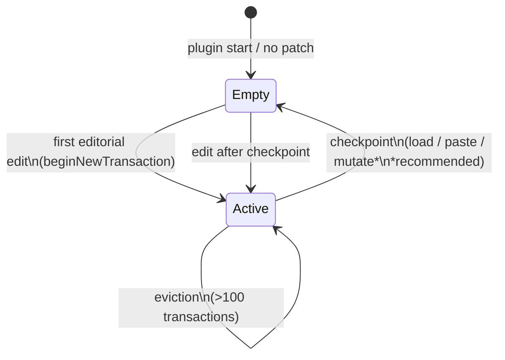
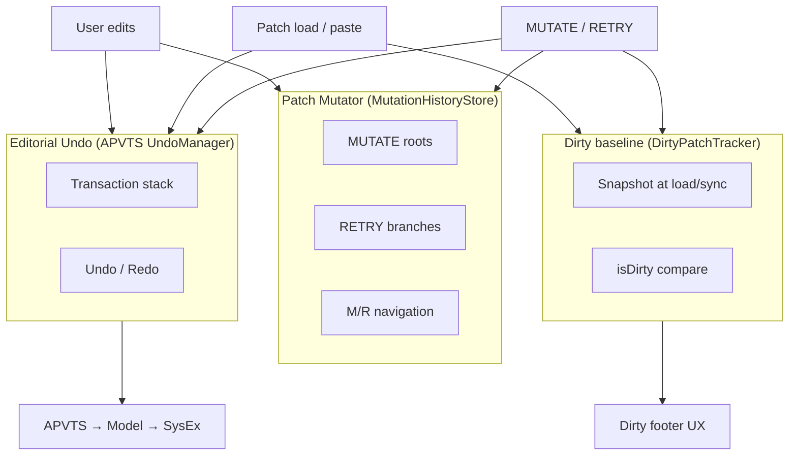
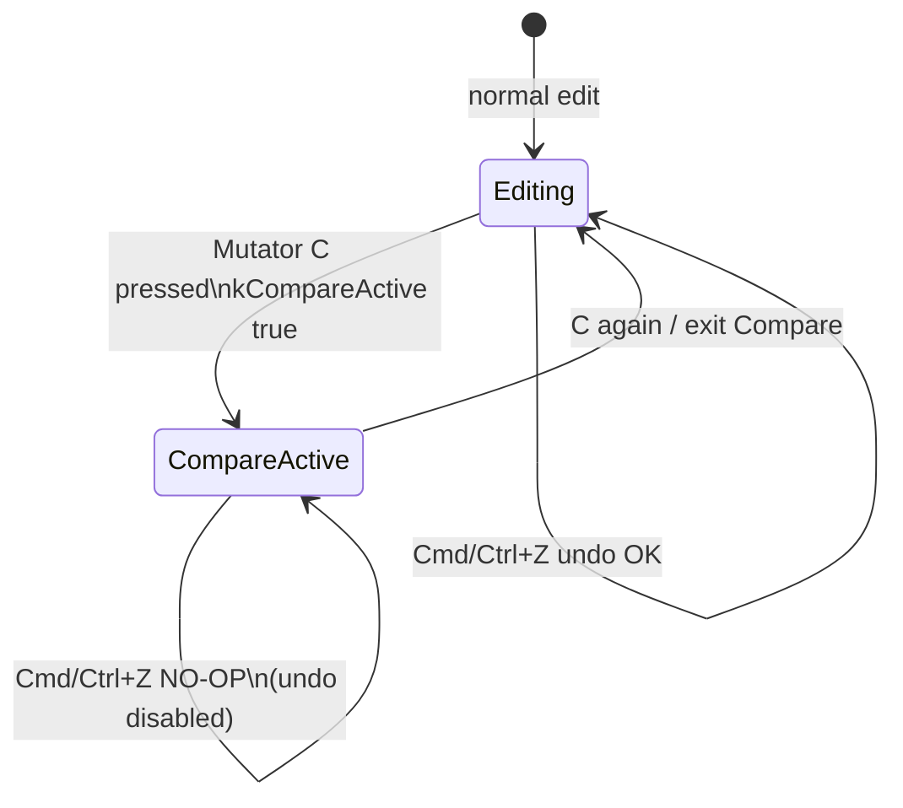
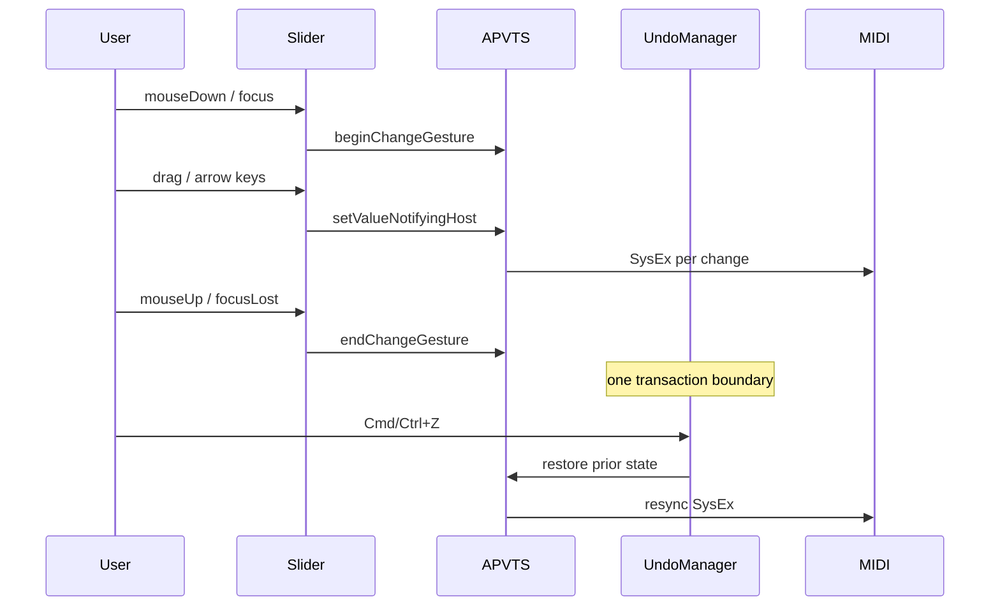
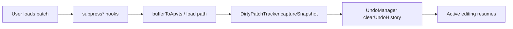

# State Machines — Editorial Undo vs Mutator vs Load

Diagrams for how editorial undo stack, Patch Mutator history, and patch-load checkpoints interact.

## Editorial undo stack lifecycle

## Three parallel histories (conceptual)

## Compare mode vs undo

## Transaction grouping (slider example)

## Checkpoint clears stack

